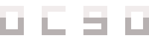

<h1 align="center">ocgo</h1>
<div align="center">
  <a href="https://github.com/ulrich-zogo/ocgo/releases">
    
  </a>
  <a href="https://github.com/ulrich-zogo/ocgo/releases">
    
  </a>
  <a href="https://github.com/ulrich-zogo/ocgo/blob/main/LICENSE">
    
  </a>
  <a href="https://go.dev/doc/go1.22">
    
  </a>
</div>

<br/>

<div align="center">
 
</div>

<br/>

<div align="center">
  <a href="https://github.com/ulrich-zogo/ocgo">ocgo</a> starts a local Anthropic/OpenAI-compatible proxy that lets Claude Code, Codex CLI, and Codex Desktop use an OpenCode Go subscription.
</div>

## What ocgo does

ocgo starts a local proxy that translates requests from your AI coding tools into OpenCode Go API calls.

- **Claude Code** uses the Anthropic Messages API proxy (`/v1/messages`).
- **Codex CLI** uses the OpenAI Chat Completions and Responses API proxy (`/v1/chat/completions`, `/v1/responses`).
- **Codex Desktop** uses the same proxy through a configurable provider.
- Your real OpenCode Go API key stays in the local config. Clients receive a fake key like `ocgo` or `unused`.

## Supported clients

- Claude Code (Anthropic Messages API)
- Codex CLI (OpenAI Chat Completions / Responses API)
- Codex Desktop (OpenAI Responses API via `ocgo-desktop` provider)

## Requirements

- Go 1.22 or newer (to build from source)
- A valid OpenCode Go API key
- Claude Code, Codex CLI, or Codex Desktop installed (depending on your workflow)

## Quick start

```bash
# 0. Check your installed version
ocgo version
ocgo version --json

# 0a. Inspect your configuration
ocgo config paths
ocgo config inspect

# 1. Save your API key
ocgo setup

# 2. Pick a default OpenCode Go model
ocgo list
ocgo opencode model set-default minimax-m3

# 3a. Launch Claude Code
ocgo launch claude --model minimax-m3

# 3b. Or launch Codex CLI
ocgo launch codex --model minimax-m3

# 3c. Or set up Codex Desktop (needs the daemon)
ocgo daemon start
ocgo codex desktop enable opencode --model minimax-m3

# 4. Diagnose any issues
ocgo doctor codex
```

## Installation

### Build from source

Clone the repository:

```bash
git clone https://github.com/ulrich-zogo/ocgo.git
cd ocgo
```

#### Linux, macOS, WSL, or Git Bash

```bash
make build       # builds bin/ocgo
make install     # installs to $(go env GOPATH)/bin or GOBIN
```

Make sure your Go binary directory is in your `PATH`:

```bash
export PATH="$(go env GOPATH)/bin:$PATH"
```

#### Windows PowerShell

PowerShell does not include `make` by default. Build directly with Go:

```powershell
New-Item -ItemType Directory -Force -Path .\bin
go build -o .\bin\ocgo.exe .\cmd\ocgo
.\bin\ocgo.exe --help
```

Install into your Go binary directory:

```powershell
go install .\cmd\ocgo
& "$env:USERPROFILE\go\bin\ocgo.exe" --help
```

If `ocgo` is not found after `go install`, add your Go binary directory to the user `PATH`:

```powershell
[Environment]::SetEnvironmentVariable(
  "Path",
  [Environment]::GetEnvironmentVariable("Path", "User") + ";$env:USERPROFILE\go\bin",
  "User"
)
```

Then close and reopen PowerShell:

```powershell
ocgo --help
ocgo version
```

See [docs/windows.md](docs/windows.md) for Windows-specific installation and source-build instructions.

### Homebrew

Install with:

```bash
brew install ulrich-zogo/tap/ocgo
```

See [docs/homebrew.md](docs/homebrew.md). See [docs/release.md](docs/release.md) and [docs/release-rollback.md](docs/release-rollback.md) for the release process and rollback procedures.

### Windows

PowerShell installer:

```powershell
irm https://raw.githubusercontent.com/ulrich-zogo/ocgo/main/scripts/install-windows.ps1 | iex
```

The installer verifies the binary with `--help`. If the installed release does not support `ocgo version`, the installer prints a warning but still completes successfully.

Scoop, after bucket publication:

```powershell
scoop bucket add ocgo https://github.com/ulrich-zogo/scoop-ocgo
scoop install ocgo
```

WinGet, after manifest publication:

```powershell
winget install UlrichZogo.OCGO
```

See [docs/windows.md](docs/windows.md).

## Setup

```bash
ocgo setup
```

Paste your OpenCode Go API key when prompted, or pass it directly:

```bash
ocgo setup --api-key sk-opencode-your-key
```

The API key can also be provided at runtime via the `OCGO_API_KEY` environment variable.

Configuration is saved to `~/.config/ocgo/config.json`. See [docs/configuration.md](docs/configuration.md) for details.

## Models

### List available models

```bash
ocgo list
ocgo ls
ocgo models
```

All three commands are equivalent. `ocgo models` resolves the catalog from the official OpenCode Go source when available, then the local cache, then the built-in fallback list.

Current models (as of this writing):

```
minimax-m3
minimax-m2.7
minimax-m2.5
kimi-k2.6
kimi-k2.5
glm-5.1
glm-5
deepseek-v4-pro
deepseek-v4-flash
qwen3.7-max
qwen3.7-plus
qwen3.6-plus
qwen3.5-plus
mimo-v2-pro
mimo-v2-omni
mimo-v2.5-pro
mimo-v2.5
hy3-preview
```

The list can evolve — run `ocgo models` for the current local catalog.

### Set a default model

```bash
ocgo opencode model set-default minimax-m3
ocgo opencode model current
```

The default model is shared across `launch claude`, `launch codex`, and `codex desktop enable opencode`. When no default is configured, the first model in the catalog is used as a fallback.

A `--model` flag on any launch command overrides the default for that session.

### Model catalog

ocgo fetches the official OpenCode Go model list on first use and caches it locally in `~/.config/ocgo/model-catalog-cache.json`. If the official source is unreachable, ocgo uses the cache, then falls back to a built-in list of known models.

### Model mapping

Optional model name routing lets you map a tool-specific name to a different OpenCode Go model. This is useful when a client hardcodes a model name like `claude-sonnet-4-20250514` and you want it to use a specific OpenCode Go model instead.

```bash
ocgo mapping claude show
ocgo mapping codex show

ocgo mapping claude get claude-sonnet
ocgo mapping claude set claude-sonnet minimax-m3
ocgo mapping claude unset claude-sonnet

ocgo mapping codex get gpt-5
ocgo mapping codex set gpt-5 deepseek-v4-pro
ocgo mapping codex unset gpt-5

ocgo mapping claude open
ocgo mapping codex open
```

- `get <source-model>` — show the current mapping for one model.
- `set <source-model> <opencode-model>` — create or update a mapping.
- `unset` (aliases: `rm`, `remove`, `delete`) — remove a mapping.
- `open` — edit the mapping file in `$EDITOR`.

Mappings are stored in `~/.config/ocgo/model-mapping.json`.

## Claude Code

### Launch

```bash
ocgo launch claude
ocgo launch claude --model minimax-m3
ocgo launch claude --yes
ocgo launch claude --model minimax-m3 -- -p "Explain this repository"
```

### Environment variables

When starting Claude Code, ocgo sets:

```bash
ANTHROPIC_BASE_URL=http://127.0.0.1:3456
ANTHROPIC_AUTH_TOKEN=unused
```

With `--model`:

```bash
ANTHROPIC_MODEL=minimax-m3
ANTHROPIC_SMALL_FAST_MODEL=minimax-m3
```

Requests for Claude/Anthropic model names are routed through any configured mapping. Unmapped names pass through unchanged.

## Codex CLI

### Launch

```bash
ocgo launch codex
ocgo launch codex --model minimax-m3
ocgo launch codex -- --sandbox workspace-write
```

### Configure without launching

```bash
ocgo launch codex --config
```

This writes the `ocgo-launch` profile and model catalog without starting Codex.

### What gets written

`~/.codex/ocgo-launch.config.toml`:

```toml
openai_base_url = "http://127.0.0.1:3456/v1/"
forced_login_method = "api"
model_provider = "ocgo-launch"
model_catalog_json = "/Users/you/.codex/ocgo-models.json"

[model_providers.ocgo-launch]
name = "OpenCode Go"
base_url = "http://127.0.0.1:3456/v1/"
wire_api = "responses"
```

`~/.codex/ocgo-models.json` contains metadata for every known OpenCode Go model. Codex receives `OPENAI_API_KEY=ocgo` so all requests route through the local proxy.

### Run from terminal

After configuration:

```bash
codex --profile ocgo-launch -m minimax-m3
```

## Codex Desktop

Desktop mode lets Codex Desktop (the macOS/Windows GUI app) use OpenCode Go through the local proxy. Unlike Codex CLI, Desktop does not launch ocgo itself — the daemon must be running.

### Prerequisites

```bash
ocgo setup
ocgo opencode model set-default minimax-m3
ocgo daemon start
```

### Enable OpenCode mode

```bash
ocgo codex desktop enable opencode
ocgo codex desktop enable opencode --model minimax-m3
```

This:

1. Backs up the existing `~/.codex/config.toml` to `~/.config/ocgo/codex-backups/`.
2. Writes an OCGO Desktop provider with `model_provider = "ocgo-desktop"` and `wire_api = "responses"`.
3. Records the OpenCode state in `~/.config/ocgo/codex-desktop-state.json`.

### Check status

```bash
ocgo codex desktop status
ocgo doctor codex --mode desktop
```

### Return to ChatGPT / OpenAI

```bash
ocgo codex desktop enable chatgpt
```

This restores the previous `~/.codex/config.toml` from the backup created by `enable opencode`. The backup is preserved so you can switch back and forth.

### Full Desktop workflow

```bash
# Initial setup
ocgo setup
ocgo opencode model set-default minimax-m3
ocgo daemon start
ocgo codex desktop enable opencode
ocgo doctor codex --mode desktop

# Later, to revert
ocgo codex desktop enable chatgpt
```

## Daemon

ocgo provides two proxy-running mechanisms:

| Command | Use case |
|---|---|
| `ocgo serve` | Foreground proxy (previous behavior) |
| `ocgo serve --background` | Background proxy (legacy) |
| `ocgo daemon start` | Background daemon (recommended for Desktop) |
| `ocgo daemon status` | Daemon health check |
| `ocgo daemon stop` | Stop the daemon |
| `ocgo daemon restart` | Restart the daemon |

The daemon is the recommended mode for Codex Desktop because Desktop needs the proxy to stay up across sessions. `ocgo daemon status` checks both the `/health` endpoint and the daemon state file.

### Daemon files

```
~/.config/ocgo/daemon-state.json
~/.config/ocgo/ocgo.pid
~/.config/ocgo/ocgo.log
```

## Doctor

The doctor is a read-only diagnostic tool:

```bash
ocgo doctor
ocgo doctor codex
ocgo doctor codex --mode cli
ocgo doctor codex --mode desktop
ocgo doctor codex --json
```

It checks:

- OCGO configuration and API key
- Model selection and catalog
- Daemon state and health endpoint
- Local proxy endpoints (`/v1/models`, `/v1/messages/count_tokens`, `/v1/responses`)
- Codex CLI binary, profile, and model catalog
- Codex Desktop config, state, and backup

The doctor never modifies files, never starts the daemon, and never switches the Desktop provider.

Exit codes: `0` = ok or warning; `1` = at least one error.

## Support bundle

Generate a redacted diagnostic bundle for bug reports:

```bash
ocgo support bundle
```

Write to a specific path:

```bash
ocgo support bundle --output ./ocgo-support.zip
```

The bundle is always redacted and can be safely attached to issues. See
[docs/support-bundle.md](docs/support-bundle.md) for details.

## Script-friendly JSON diagnostics

The following commands produce strict JSON on stdout when `--json` is given,
suitable for use in scripts, CI, and support tools:

```bash
ocgo version --json
ocgo doctor --json
ocgo daemon status --json
ocgo config paths --json
ocgo config inspect --json
ocgo support bundle --json
```

In JSON mode, successful commands write only JSON to stdout. Human-readable
output is reserved for text mode.

Diagnostic JSON output never includes API keys or bearer tokens.

Exit codes:
- `0` on success
- Non-zero on command failure
- `ocgo doctor --json` may return `1` when at least one check is in error
  (JSON output is still valid)

## Installation smoke tests

To validate local release artifacts before publishing:

```bash
scripts/build-release-artifacts.sh v0.0.0-smoke
scripts/smoke-release-install.sh --dist dist --version v0.0.0-smoke
```

On Windows:

```powershell
.\scripts\smoke-release-install.ps1 -Dist .\dist -Version "v0.0.0-smoke"
```

See [docs/install-smoke.md](docs/install-smoke.md) for package manager smoke tests and detailed documentation.

## Repository governance

The canonical repository is:

```text
ulrich-zogo/ocgo
```

Repository governance, fork detachment, and branch protection are documented in:

```text
docs/repository-governance.md
docs/branch-protection.md
docs/github-support-unfork-request.md
```

Quick checks:

```bash
make check-repo-ownership
make audit-repo-governance
```

## E2E smoke tests

Workflow smoke tests validate real user scenarios from fresh config through
diagnostics, model selection, daemon lifecycle, Codex CLI/Desktop integration,
and config backup/reset:

```bash
go test ./internal/e2e -run E2E -v
```

See [docs/e2e-smoke.md](docs/e2e-smoke.md) for details.

### Optional real daemon smoke test

The default test suite uses app-level daemon stubs. To test a real background
daemon process:

```bash
OCGO_E2E_REAL_DAEMON=1 go test ./internal/e2e -run RealDaemon -v
```

See [docs/real-daemon-smoke.md](docs/real-daemon-smoke.md).

## Remote Codex

ocgo's proxy listens on `127.0.0.1:3456` by default. When Codex CLI runs on the same machine, this works as-is.

If Codex CLI runs in a container, VM, or cloud workspace, `127.0.0.1` refers to the remote environment, not your local machine. Options:

- Run ocgo inside the same remote environment.
- Change the proxy to listen on `0.0.0.0` and connect via LAN IP.
- Use an SSH tunnel or VPN to forward the port.

> **Warning:** Do not expose the proxy to the public internet. The proxy uses your OpenCode Go API key and has no authentication of its own.

For LAN access, set `~/.config/ocgo/config.json`:

```json
{
  "api_key": "sk-opencode-...",
  "host": "0.0.0.0",
  "port": 3456
}
```

Then in the remote Codex profile, set `openai_base_url = "http://<HOST_IP>:3456/v1/"`.

## Configuration files

See [docs/configuration.md](docs/configuration.md) for a complete reference of configuration files, their locations, and formats.

## Proxy API

The local proxy exposes these endpoints:

| Endpoint | Method | Used by | Notes |
|---|---|---|---|
| `/health` | GET | Monitoring, doctor | Returns `ok` |
| `/v1/messages` | POST | Claude Code | Anthropic Messages → OpenCode Go → Anthropic-shaped response |
| `/v1/messages/count_tokens` | POST | All clients | Local approximate token count, no upstream call |
| `/v1/chat/completions` | POST | Codex CLI | OpenAI-compatible passthrough with API key injection |
| `/v1/responses` | POST | Codex CLI, Desktop | OpenAI Responses API adapter (chat completion bridge) |
| `/v1/models` | GET | All clients | Local model list from catalog/cache/fallback |

- `/v1/messages/count_tokens` is computed locally using character-based heuristics. It is deterministic and non-zero for any meaningful input, but it is not byte-compatible with any proprietary tokenizer.
- `/v1/responses` validates requests locally (empty bodies return 4xx) before forwarding valid requests upstream.
- `/v1/models` uses the official OpenCode Go catalog when available, falls back to the cached version, then falls back to a built-in list.

## Troubleshooting

See [docs/troubleshooting.md](docs/troubleshooting.md) for detailed troubleshooting of:

- Codex Desktop not responding
- Returning to ChatGPT / OpenAI
- Codex CLI not seeing models
- Invalid model errors
- Proxy unreachable
- Remote Codex (container / VM / cloud workspace)
- Token counting inconsistencies
- Doctor diagnostics

## Development

### Build

Linux, macOS, WSL, or Git Bash:

```bash
make build       # bin/ocgo or bin/ocgo.exe depending on GOOS
make install     # installs to $(go env GOPATH)/bin or GOBIN
make test
make run
make clean
```

Windows PowerShell:

```powershell
New-Item -ItemType Directory -Force -Path .\bin
go build -o .\bin\ocgo.exe .\cmd\ocgo
go test ./...
go run .\cmd\ocgo
Remove-Item -Recurse -Force .\bin, .\dist -ErrorAction SilentlyContinue
```

### Prerequisites

- Go 1.22+
- A valid OpenCode Go API key for testing

Linux, macOS, WSL, or Git Bash:

```bash
git clone https://github.com/ulrich-zogo/ocgo.git
cd ocgo
go mod download
make build
bin/ocgo setup
```

Windows PowerShell:

```powershell
git clone https://github.com/ulrich-zogo/ocgo.git
cd ocgo
go mod download
New-Item -ItemType Directory -Force -Path .\bin
go build -o .\bin\ocgo.exe .\cmd\ocgo
.\bin\ocgo.exe setup
```

### Release

```bash
make release TAG=v0.2.0
```

Requires `gh` (GitHub CLI) for creating releases and updating the Homebrew formula. See [docs/release.md](docs/release.md) for the full release process and [docs/release-rollback.md](docs/release-rollback.md) for rollback procedures.

## Upgrading from earlier versions

```bash
# Refresh the model catalog
ocgo list

# Choose a default shared model
ocgo opencode model set-default minimax-m3

# Regenerate Codex CLI profile
ocgo launch codex --config

# Restart the daemon
ocgo daemon restart

# Re-enable Desktop OpenCode mode
ocgo codex desktop enable opencode

# Verify everything
ocgo doctor codex
```

Changes to note:

- If you previously used `serve --background`, you can keep it for CLI workflows, but use `daemon start` for Codex Desktop.
- If you hardcoded `kimi-k2.6` as a model, switch to the shared default model selection.
- Model mappings remain optional.

## Client configuration validation

See [docs/client-validation.md](docs/client-validation.md) for detailed validation steps for Claude Code, Codex CLI, and Codex Desktop.

## Limitations

- Token counting is local and approximate. It does not attempt to reproduce any proprietary tokenizer.
- The `/v1/responses` adapter targets the text and tool-call workflows used by Codex. It is not a full OpenAI Responses API implementation.
- Codex Desktop requires the local daemon to be actively running.
- Tool calls and streaming are supported in the workflows covered by Claude Code and Codex CLI, but not every edge case of every upstream API is tested.

## License

MIT. See [LICENSE](LICENSE).
